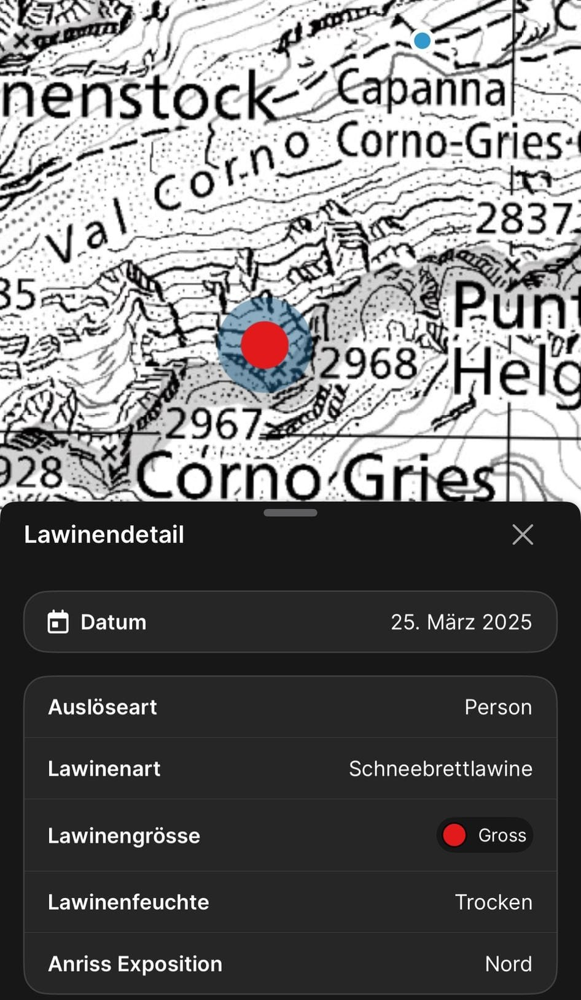
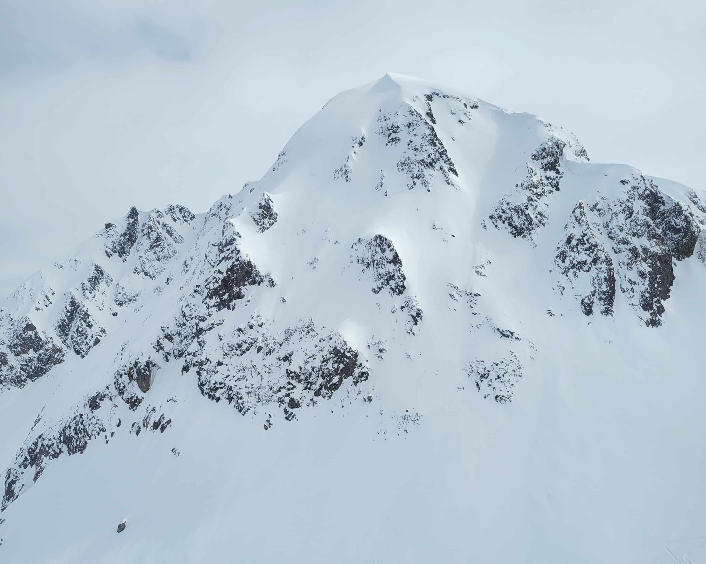
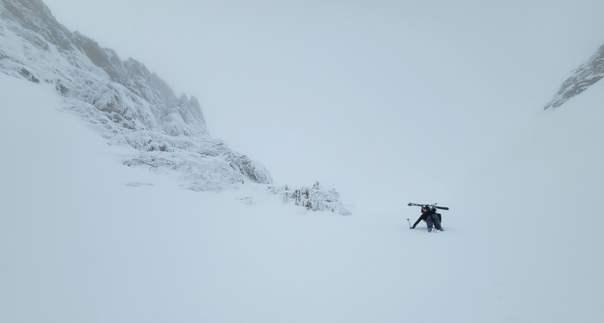
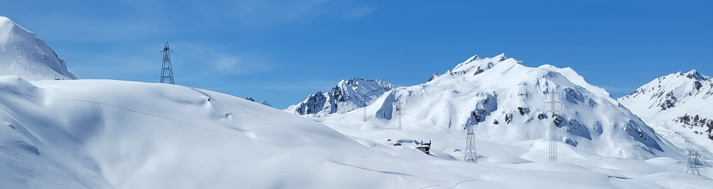
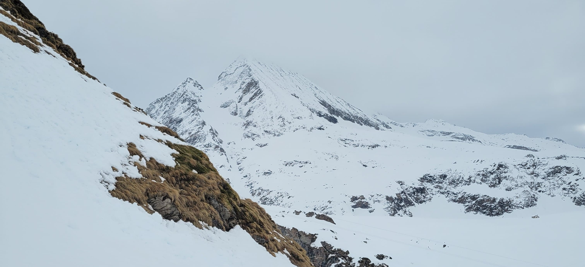
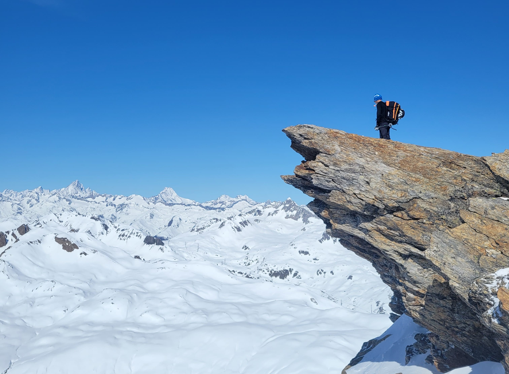
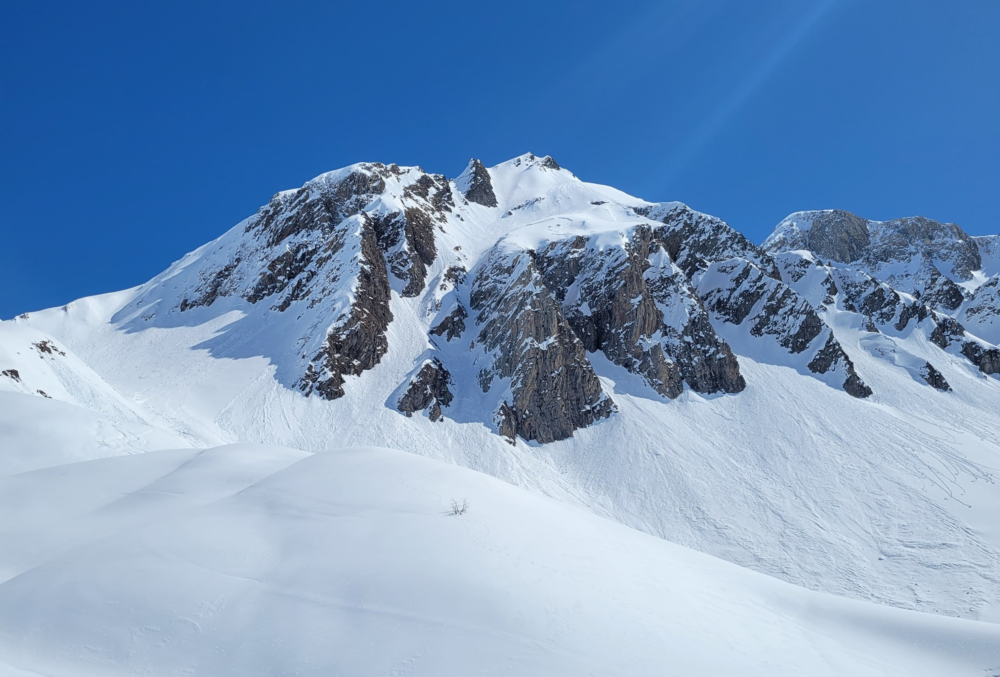

### Introduction
If you live in Switzerland and regularly venture into the mountains, then the name **"Bedretto"** will certainly sound familiar. It's not only one of the sunniest corners of Switzerland, but in the last week of March, it often transforms into a true snow haven. And that’s exactly what happened this year – fresh snow in abundance, perfect conditions for unforgettable powder days – or so we thought, as our overconfidence nearly cost us dearly.

This report aims not only to document some very interesting couloirs and slopes on the southern side of Bedretto but also to inspire your own creativity. However, it is important to emphasize that undocumented routes must be carefully planned and approached with the necessary caution and thought. Mountain sports thrive on discovering new routes and sharing those experiences with others who are passionate about the mountains.

> **Note:** We have intentionally left out detailed route descriptions because we believe it is part of the sport to inform and plan for yourself. There are already plenty of well-documented routes, and not everything needs to be described in detail – otherwise, the sport loses some of its appeal.

Some couloirs were explored and inspired by <a href="https://chmoser.ch" target="_blank">chmoser.ch</a> and  <a href="https://www.patricia-neuhauser.ch" target="_blank">patricia-neuhauser.ch</a>. Many thanks for your contributions!  
Make sure to check out their website – it's absolutely worth it!

---

### Mistake Culture in Mountain Sports

I would like to take this opportunity to briefly address the often-taboo topic of **"mistakes"** in mountain sports. Unfortunately, it's still not a given that mountaineers speak openly about their mistakes. Yet that is exactly what we need to learn from one another and be safer together – provided it happens without judgment or unnecessary commentary.

We ourselves made a serious mistake over the past five days. The avalanche level was 3, with 30 cm of fresh snow, an old weak layer, and moderate north wind – a dangerous combination. In the previous days, all the couloirs we skied held up, so we unknowingly entered a spiral of overconfidence. While descending the north face of the **Rothentalhorn**, the second skier triggered a slab avalanche with a 40 cm crown. Fortunately, the person below was able to get to safety, and the skier remained uninjured.

**What went wrong?**  
  Our overconfidence, the lack of a reassessment of the snowpack, and ignoring warning signs.

**What did we learn?**  
  Better-planned stopping points, constant reassessment of the slopes, and a more defensive approach.

> Mistakes happen – that’s human. But what matters is that we learn from them and talk openly. Stay safe out there!

---

### Grieshörner and North Faces

Many visit the **Capanna Corno-Gries** to climb the **Blinnenhorn**. But they often overlook some fantastic slopes right next to the hut. The entire north-facing ridge offers skiing fun with slopes starting at 35° and countless lines – enough to spend weeks in this area. The **Helgenhorn** is the most well-known, but why stop there? In good conditions, both the western face of the Helgenhorn and the descents from the **Rothentalhorn** can be enjoyed. It may only be a few kilometers, but they offer maximum ski enjoyment. Both the **Kleine** and **Grosses Grieshorn** also offer several interesting couloirs.

Grosses Grieshorn

---

### P.2799 North Couloir

On the Italian side, southwest of **Corno Brunni**, lies **P.2799**. While not a particularly remarkable peak in itself, it hides a very intriguing north-facing couloir.

You can access it either directly by ascending or – if you have a bit of mountaineering spirit – via the **west ridge**. The couloir is up to **45° steep** and offers an impressive atmosphere and fantastic views. It also allows a descent all the way to **Bättelmatt**, near the **Rifugio Città di Busto**.

---

### Corno Mutt Northeast Couloir

This **200-vertical-meter**-long northeast couloir is arguably one of the most striking in terms of massiveness. A prominent rock formation is sliced by a deep snow gully – a line just begging to be skied. In the upper section, the couloir is at least **45° steep**, before easing off to about **40°** lower down.

In the horizon

---

### Kastelhorn West Couloir

This couloir is neither particularly difficult nor technically demanding, but its presence is striking. It's very wide and, with a slope angle of just **35°**, it's ideal for beginners looking to try this style of skiing. Access is either directly through the couloir with numerous kick turns or via the **eastern side**. The descent covers around **500 vertical meters** and rewards with a magnificent view.

---

### Marchhorn: West Couloirs and Canalone del Marchhorn

The **Canalone del Marchhorn** is often skied and well documented – so we’ll skip a detailed description. However, the **Marchhorn** has more to offer than just the well-known canalone. Several interesting couloirs are also found on the **western side**. Anyone standing in front of it will spot them immediately. They can be accessed either by ascending the couloir directly or via the normal routes to the Marchhorn.

---

### Pizzo San Giacomo Forepeak North Face

From below, it may seem like this face is unrideable – but under the right conditions, it is very doable. The **forepeak** of the **Pizzo San Giacomo** (west of the main summit – **P.2892**) is relatively easy to reach. The **drop-in** can be made either directly from the summit or – in trickier conditions – from a **saddle located to the northeast**. The line weaves through the face, and you definitely feel like a **steep-skiing pro**.

---

### Pizzo Grandinagia

The forepeak of **Pizzo Grandinagia** offers three couloirs: one **western**, one **northwestern**, and one **northeastern**.

The **western couloir** is best accessed directly via the couloir itself, but an entry from the summit is also possible – though it involves a short **climbing section with crampons and ice tools**.

For the other two couloirs, it's best to follow the **normal route** documented on the **SAC tour portal**. The **northwestern couloir** can be skied directly from the summit but includes a **narrow choke** and is overall technically demanding. The **northeastern couloir** can be reached either by **downclimbing or rappelling** from the summit (there are no fixed anchors). Depending on the conditions, it may also be possible to traverse to the couloir on skis from the **southern side**.

NW-Couloir

---

### Conclusion

**Bedretto South** offers countless additional opportunities for creative skiers. Some descents require technical know-how, others are simply a joy – and that’s exactly what makes it so appealing. Perhaps some of these lines will become future projects for us and others looking for new, steep challenges. **Stay creative, stay safe, and enjoy the mountains!**
