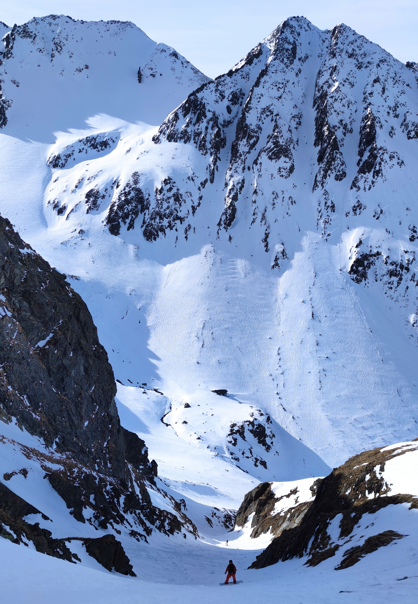

### The Start
Our adventure began early in the morning. The first meeting point was Olten train station, where Manuel, who fortunately had a car, picked me up, David. Our next destination was Lucerne to collect Köbi. Unfortunately, Köbi realized he had forgotten his ski boots, so we had to make a brief detour to his home to retrieve them. Fortunately, the detour was minimal, so our schedule was only slightly affected. With our goal now firmly in sight and full of anticipation, we headed towards Andermatt. There, we discovered that many other skiers and snowboarders had similar plans. This resulted in a longer wait time before we finally reached the Gemsstock. Normally, this doesn't take long, but we experienced about an additional hour of delay, an almost classic initial error.

### Chastelhorn 
Upon arrival at the top, we were greeted by our first descent: a short stretch along the icy piste down to the St. Annafirn, or what remained of it. However, our goal was not only the Blauberg Couloir but also the steep Chastelhorn South Face. Once we reached the Chastelhorn summit, we were treated to an impressive view of the Blauberg Couloir in all its glory. Unfortunately, the descent from the Chastelhorn proved to be quite challenging due to the long period without fresh snow, making it a true test. Every edge had to be perfectly set to avoid sliding down.

### Reascend
Thanks to our careful planning, we knew that the Blauberg Couloir, a north-facing descent, would be filled with beautiful windblown snow. After successfully completing the Chastelhorn descent, we began the ascent again. Only 400 vertical meters separated us from the easy climbing section to the Blauberg. With the trail already well-marked, the ascent went smoothly. Along the way, we had a few pleasant conversations with other skiers and even had time for a light lunch of homemade sandwiches with butter and cheese. There was no time for more, but that was not necessary—we were here for the fantastic descents, not the food.

### The Couloir
Finally, we reached the small climbing section to the Blauberg. In our excitement, we had forgotten to put on our crampons in advance, which meant we had to attach them during the ascent. It wasn’t particularly comfortable, but manageable. 

Once at the top, we took the obligatory photos before plunging into the windblown snow-filled couloir. Köbi took the first few meters with skillful and beautiful turns, followed by Manuel, who mastered the technique needed to navigate a couloir. Finally, I, David, enjoyed the thrill of being back on powder. After the amazing descent, we only had to pass through Guspis to reach the old pass road, which went surprisingly smoothly. This road eventually led us to Andermatt. Given the less-than-ideal time window, we ended the tour with a leisurely hike, reminiscing about the fantastic day. One important takeaway is to always consider the wind, temperature, weather reports from the past weeks, and the avalanche bulletin when planning, to find the best powder.

