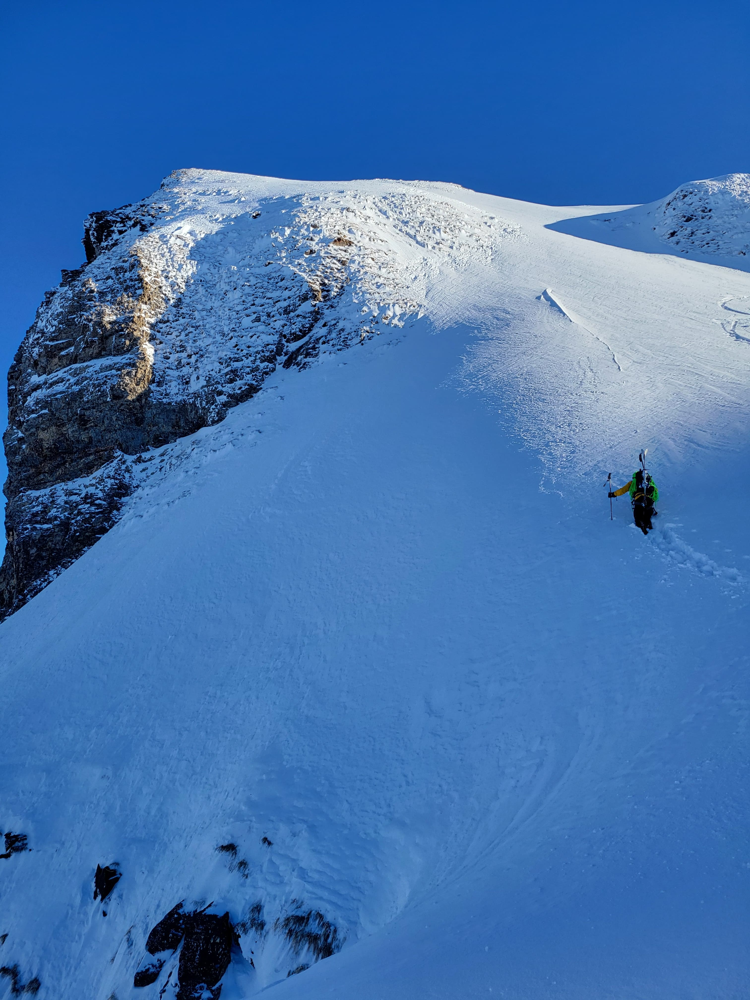
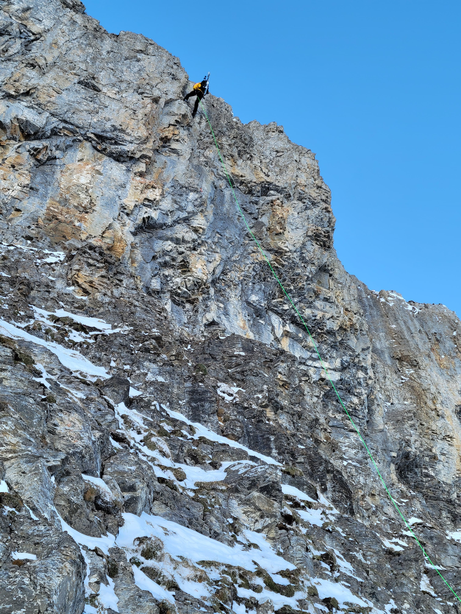
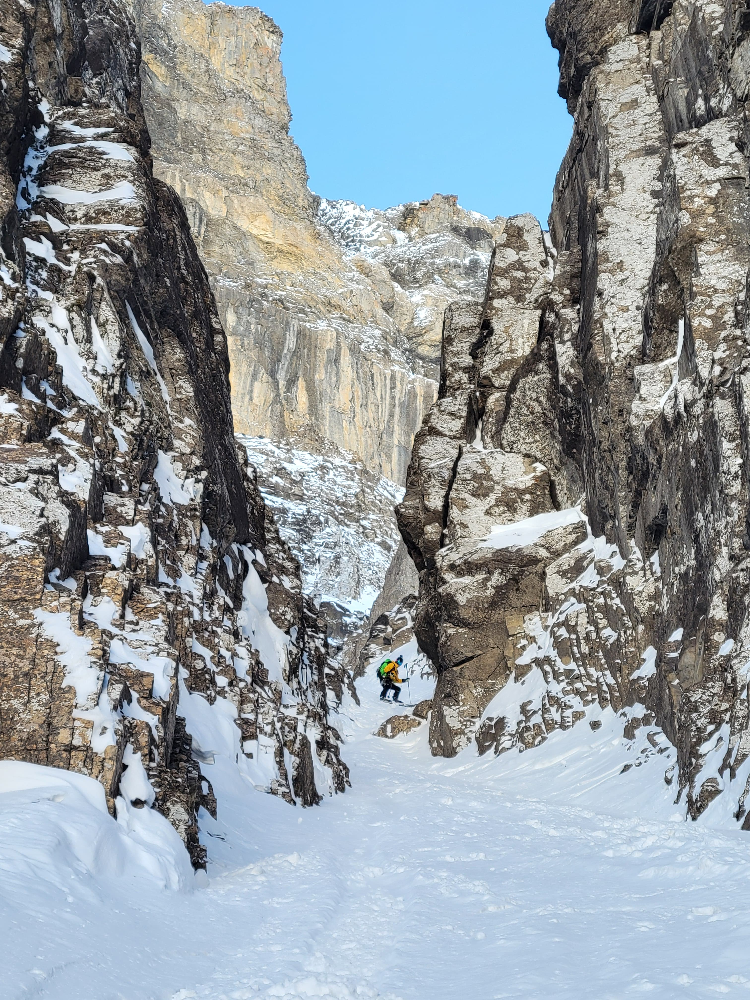
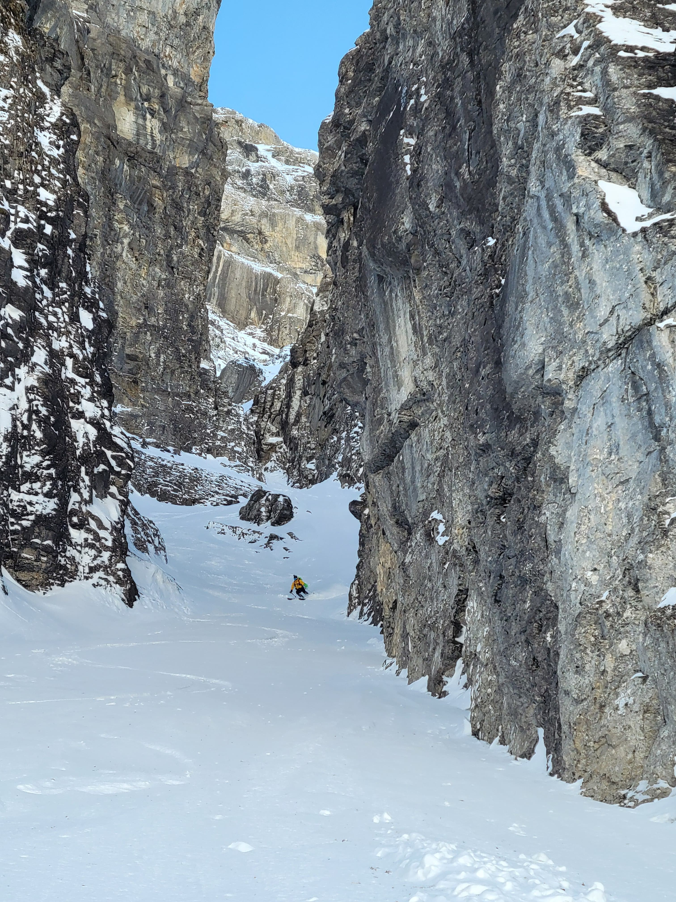

### The Beginning of the Journey
Our adventure started early on the Bannalp in Oberrickenbach, a small yet picturesque spot in the Swiss Alps. The day began with a ride on the charming cable car that took us swiftly up to the Bannalp. The views were breathtaking, but the sight of a large group of tourers heading in the same direction was less appealing. Determined to escape the crowd, we set off at a brisk pace, overtaking several groups. By the time we reached the Chaiserstuel after just 1 hour and 15 minutes, we felt exhilarated and ready for what lay ahead.

---

### A Private Powder Run
Before tackling the main event, we treated ourselves to an unexpected delight: an untouched slope in a western direction, far from the busy paths of other skiers. The powder was flawless—light, fresh, and perfect for carving elegant turns. For a few precious moments, it felt like the entire mountain was ours alone.

---

### Reaching the Rappel
Once we had our fill of powder, it was time to transition to a more technical challenge. We strapped our skis to our backs and trudged through snow along a narrow northern ridge to the first rappel point. Here, the adventure truly began.

The descent involves 60 meters of abseiling, which can be done in a single stretch or divided into multiple segments, thanks to the three established rappel stations. With a 60-meter rope, we opted for a two-stage descent, bypassing the third rappel entirely. For those who might shy away from abseiling, there’s an alternative route directly to the couloir, but trust us—rappelling adds an unforgettable thrill to the experience.

---

### The Ascent to the Couloir
After completing the rappel, a short but steep climb awaited us. Despite the effort, we quickly reached the entrance to the couloir, where excitement replaced any lingering fatigue. Tracks from previous skiers hinted at others who had enjoyed this route before us, but the couloir still promised plenty of adventure.

---

### Entering the Canal del Emperador
As we made our first turns in the couloir, the surrounding Dolomite-like rock walls loomed dramatically above, adding to the sense of grandeur. The initial stretches were smooth, but soon we faced the couloir’s most famous challenge: the narrow passage.

At just 1.5 meters wide, the passage was tight under the best conditions. To complicate matters, a protruding rock made the passage even trickier due to the thin snowpack. After a quick mental calculation, we positioned our skis and board perfectly straight and powered through with precision. It was a heart-pounding moment but one we conquered without a scratch.

---

### Powder Perfection
Once through the narrow section, the couloir opened up again, revealing more pristine powder. Every turn felt effortless, the snow light and playful beneath us. This was the moment we had dreamed of—a reward for the challenges we had faced earlier in the day.

---

### A Day to Remember
As we reached the end of the couloir, we were filled with a sense of accomplishment and awe. The Canal del Emperador had delivered everything we hoped for: thrilling technical sections, untouched powder, and breathtaking scenery.

Reflecting on the day, we couldn’t help but feel grateful for the unique experiences the Swiss Alps offer. This wasn’t just a ski tour—it was an adventure that pushed us, thrilled us, and left us eager to return for more.