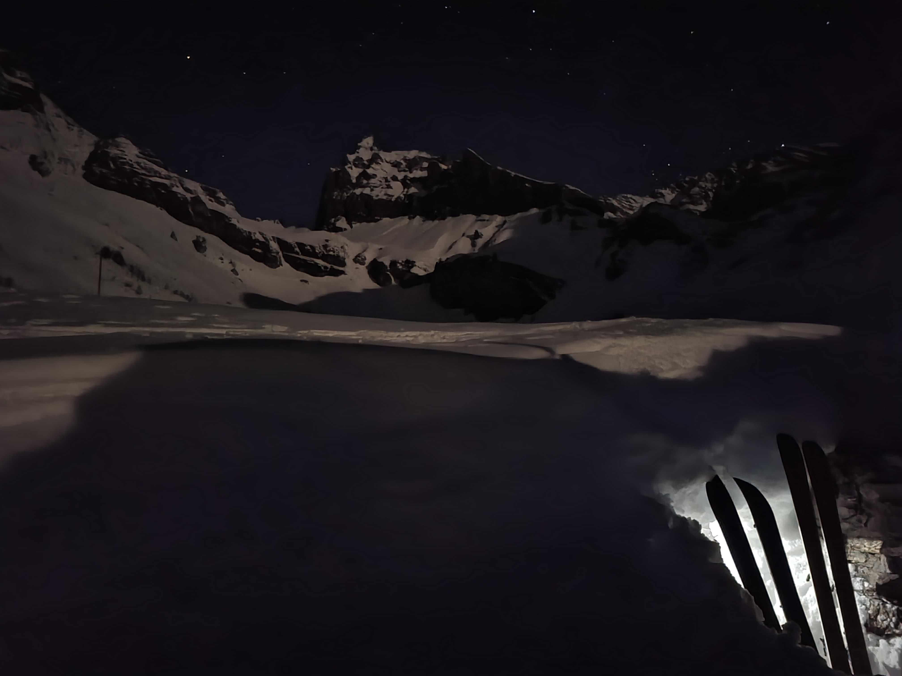
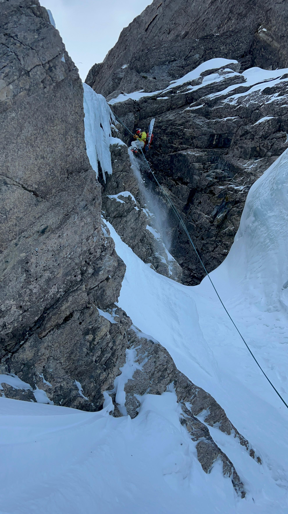
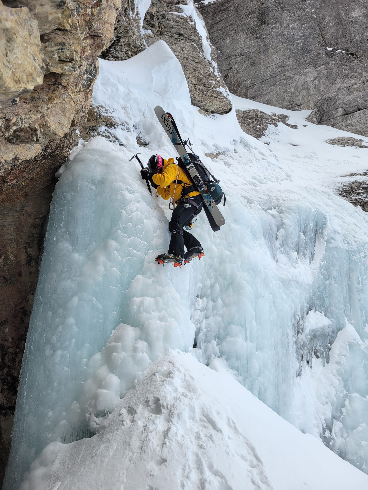

### Couloir du Goutch
Some time ago, we learned about the Couloir du Goutch, located on the northern side of Petit Muveran in Ovronnaz. However, for us, who don’t live nearby, this undertaking required significant planning and a substantial time investment.

---

### Journey and Unique Accommodation 
Our initial idea was to travel comfortably to Ovronnaz and stay in a hotel. Unfortunately, this turned out to be more challenging than expected: firstly, almost everything was fully booked, ski season and weekend, and secondly, the few available accommodations were simply too expensive. After a brief discussion, we decided: we would spend the night in a snow cave!

This meant carrying 17 kilograms of gear on our backs! Yes, we could have packed better, but luckily, fitness wasn’t an issue. We reached Ovronnaz on the last bus, which felt like a journey to another world.

Once there, we had to climb 400 vertical meters to Alp Saille (P.1786). Fortunately, the path was mostly along a wide route, allowing us to make quick progress. Our plan was to dig in near the houses to create some wind protection. But after a bit of digging with our shovels, a hollow space suddenly opened up: the covered entrance of a hut. Jackpot! This meant less digging, great wind protection, and temperatures above freezing. Compared to a traditional snow cave, this was a villa! We made ourselves comfortable and rested for the next day.

---

### Ascent to the Couloir
The morning started off relaxed. After a leisurely breakfast, we began our ascent, about 800 vertical meters to the saddle of Petit Muveran awaited us. The route initially led through a steep couloir, where we had to take off our skis and make a trail on foot. Soon we reached the final slope that needed to be climbed. We had hoped for soft corn snow but were instead met with hard snow, forcing us to use crampons. This was exactly why we had packed them.

At the saddle, it was time to remove the skins and prepare for an exciting descent. The strong southern winds of recent days had deposited fresh wind-blown snow onto the north-facing slopes, making the avalanche situation potentially critical. However, we had carefully studied the snow conditions and surrounding snow profiles, so we knew what we were getting into.

---

### Descent... or more Mountaineering?
After a short traverse, we reached the first narrow section of the couloir and navigated it with precise turns. As we passed through it, we suddenly noticed snow coming down from above. We immediately sought shelter behind a rock, fearing the worst. Then we saw that others were also on the route. It turned out we had encountered two of the best steep-skiing athletes in the world, presumably Florian Bruchez and Jeremie Heitz (though we aren’t 100% sure). We would like to take this opportunity to sincerely thank them for opening this incredibly thrilling route!

  First sighting, opening, and equipping by Florian Bruchez, Alex Chabod, Kevin, and Vivian Gex on Saturday, February 24, 2018.  
  More details: <a href="https://www.camptocamp.org/routes/974432/fr/petit-muveran-couloir-du-goutch" target="_blank">Camptocamp Route</a>

The first few meters we could still manage on skis, but poor snow conditions forced us to attach the skis to our packs. While the other two descended the large icy rock using crampons, we opted to rappel. It cost us only a maillon – almost free! After the first rappel, we continued to the official rappel point, which was easy to find thanks to a blue carabiner. Here, we rappelled a second time.
reached the trees, and a traverse to another couloir was required.

But it didn’t stop there: a short section over bare ice also required our ice-climbing skills. After that, though, a dreamlike stretch of couloir descent awaited us, which we enjoyed as much as possible. Soon, however, we reached the trees, and a traverse to another couloir was required.

---

###  Adventure to the Valley
The traverse was manageable for skiers but a real challenge for splitboarders. It dragged on, and we had to make sure to stay as high as possible. Depending on the snow conditions, the traverse had to be extended to the wall before descending into the couloir. Caution: don’t go too far! Otherwise, you’ll end up at a waterfall that plunges almost vertically into the valley.

As soon as possible, we kept to the right, as described on CampToCamp. The GPX file of the route isn’t very precise, so it’s important not to lose your bearings. The final turns were tough, the combination of inadequate sleep, heavy gear, and tired legs took its toll. But the joy and excitement outweighed all the exhaustion.

Finally, we reached the valley and followed the hiking trail down. With skis, this was no problem, and even our splitboarder switched to skis to efficiently handle the few uphill sections. We were so fast that we even caught the bus!

---

### Conclusion
A thrilling, captivating, and unforgettable adventure that offers everything you could wish for. With less gear, it would have been faster, but the fun and challenge were absolutely worth it!
