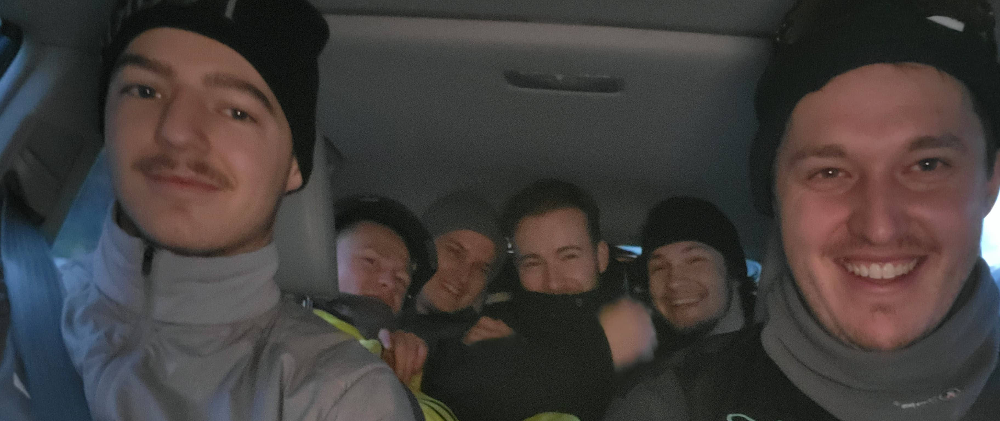
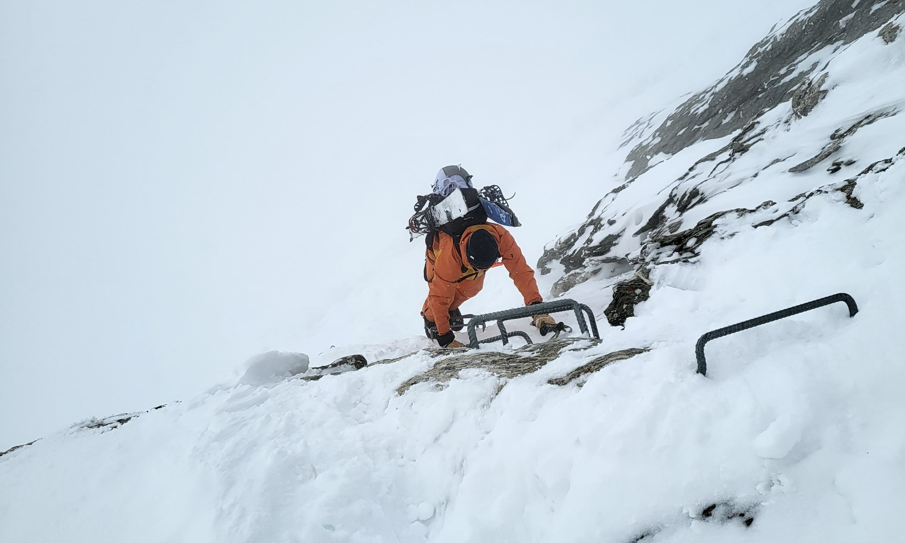
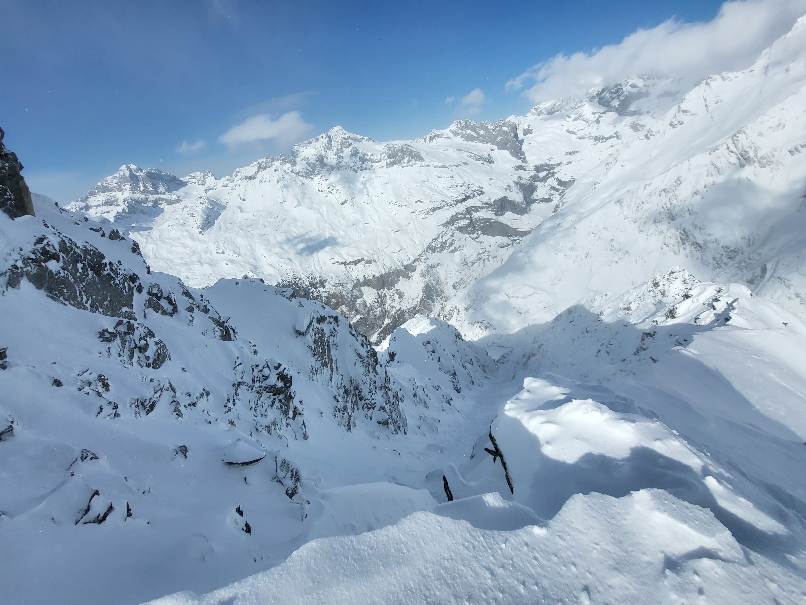

### The Start
We were a total of six people, all with this wonderful goal in mind. The weather was mediocre, but a stable snow base and 30 cm of fresh snow convinced us to tackle the big objective.
We met in Bristen with two cars. Once there, we loaded all the equipment and everyone into one car. We already knew that this car had a nail in the tire that we had picked up along the way. But we were optimistic and set off snugly.
On the drive to Andermatt, everything went smoothly, and the nail was almost forgotten when suddenly the car started rumbling and the tire was flat. Since it was a parent’s car, we didn’t know if there was a spare tire, as our driver said it was never taken along.
We were already considering abandoning the tour and were therefore very surprised to find out that there was indeed a spare tire. While three people changed the tire in a Formula 1 style, the other three took a break, which they deserved.
Shortly after, we were back on the road and managed to catch the first train from Andermatt to Disentis. The train ride calmed our nerves and made us happy. Courageously, we started the tour.

---

### First Steps
After a bit of button-lift riding, we were soon ready to start hiking. The first ascents were tough, as we had to fight through the fresh snow. But we persevered and soon reached the ladder that led us to the saddle of Piz Ault. The term “ladder” is somewhat exaggerated, as it was merely a few iron bars in the rock.
The visibility deteriorated, and a difficult section lay ahead. We decided to tackle it on foot, as the strong wind and poor visibility made communication impossible—even with our radios.
Soon, the weather cleared, and we found ourselves on the Brunnifirn, which unfortunately turned into a test of patience and strength for us splitboarders. With little fresh snow, a descent is guaranteed, but with a lot of new and windblown snow, we were forced to cross-country ski.

---

### The Couloir
The reward, however, was not lacking, as the descent into Brunnital was phenomenal and offered wonderful powder. The ascent back to Fruttstock was relatively easy again, as, to our surprise, a track had already been set. However, the track was quickly covered by windblown snow.
Upon reaching the top, we briefly enjoyed the beautiful weather and looked for the entrance to the couloir. Soon after, we made our first turns in the 800-meter-long couloir. It was a true dream that will remain in our memories for a long time. After this legendary descent, we only had to walk back to Bristen, and then we were on our way home.
