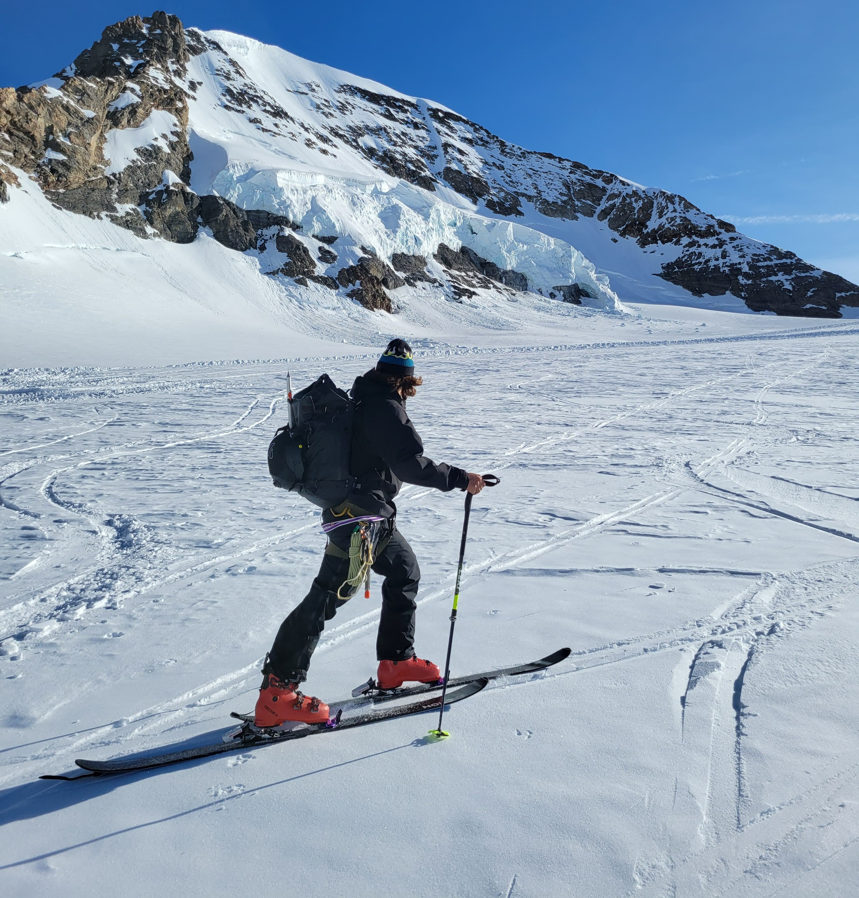
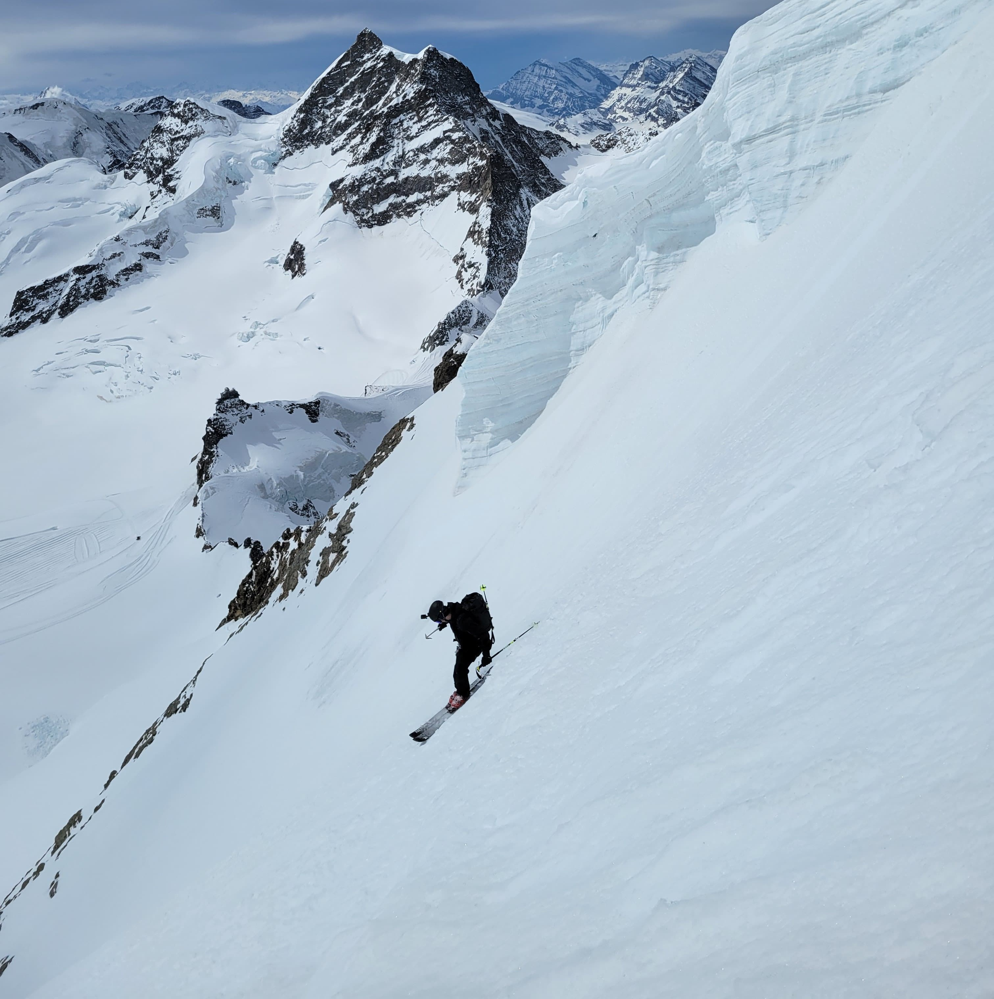
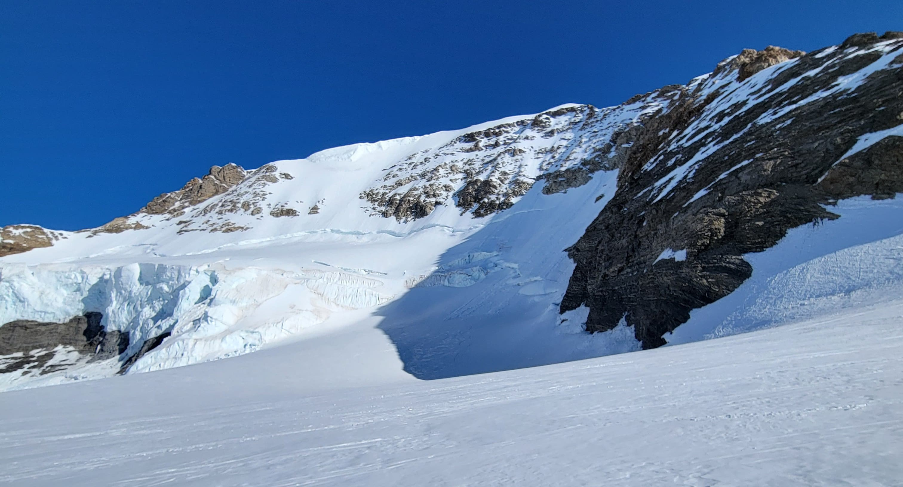
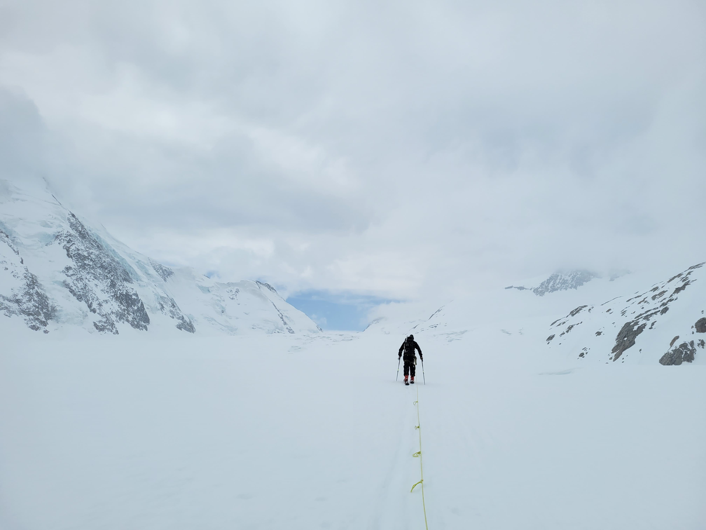

### Mönch

The Mönch is an undisputed classic among the 4'000-meter peaks of the Bernese Alps. Often considered a *relaxed day tour*, it's a mountain that should not be underestimated. While its standard route is relatively straightforward, the Mönch offers a wide range of climbing options that appeal to both alpine newcomers and experienced mountaineers.

There are several ways to reach the summit of the Mönch:  
**Northeast or South Face**  
**Southwest Ridge (SW Ridge)**  
**North Rib**  
the well-known **Nollen Route**  
or the classic **Normal Route via the South Ridge**

Each route has its unique challenges – be it technical terrain, exposure, or objective dangers. But one thing is certain: every route is worthwhile in its own right.

> **Caution:** The Mönch is not a peak to be "tacked on" spontaneously. While the ascent via the South Ridge is graded at only **UIAA II**, and presents few difficulties for experienced climbers, the summit ridge is extremely narrow in parts – sometimes too narrow to place both feet side-by-side. Surefootedness and alpine experience are essential.

Looking for more of an adventure? Then go for the **Nollen Route** or the **SW Ridge** – both offer a real taste of classic alpine climbing.

Here’s a cool trivia fact: In 1996, a new survey revealed that the Mönch is actually 9 meters taller than previously recorded. Its new official height is 4'107 meters, securing its status as a prominent 4'000er in the Alps.    
<i>(Source: 4000er Tourenführer, Dr. phil. Richard Goedeke)</i>

---

### Steep & Sweet

Our objective was crystal clear: Ski the Mönch – whether from the South or Northeast Face didn’t matter. It just had to be steep and sweet. Unfortunately, we only had one day, and the weather was a bit unstable. So we took the first train from Spiez and hopped on the [staff train to Jungfraujoch](https://www.jungfrau.ch/en-gb/jungfrau-ski-region/grindelwald-wengen/ski-touring/).

Soon after, we found ourselves approaching the start of the route. We calmly strapped our skis to our backpacks, roped up, and set off. Many people climb the Mönch without a rope, which is totally legit under good conditions. But for us, roping up was the safer choice, as one member of our team wasn’t yet fully confident on exposed ridges.

The first few climbing moves were clumsy – we were a bit out of practice. But before long, we found our rhythm and started making good progress. The few climbing sections became no issue at all. However, we could definitely feel the altitude kicking in – every step got heavier.

Luckily, the firn was grippy, allowing us to stay focused on the climb. Just below the summit, where the ridge narrows dramatically, we removed our skis and got ready for the descent via the **South Face**.

> The Northeast Face, like many north-facing slopes at the time, was not skiable – almost completely bare ice and only suitable for technical ice climbing. That might hopefully change with the next snowfall.

Skis on, ready to drop – but the snow up top wasn’t promising. The upper third hadn't softened despite the sun. The result? Hardpack and tiring jump turns. Turn by turn, we made our way down.

Then suddenly – soft snow! The sun had done its work lower down, and we were finally able to enjoy almost perfect, buttery turns. That moment alone made the whole effort worthwhile.

The final challenge: the bergschrund* And wow, it was gnarly. In its current state, it was – to use some Swiss slang – "absolut beschisse" But if you take the time to scout the best crossing point on the way up, it becomes manageable. For us, it meant one thing: take a leap. With enough speed and commitment, we cleared it no problem.

Shortly after, we were back on the groomed path, proud and exhausted, savoring a last look back at that beautiful line.

---

### Next Steps

Originally, we’d planned to tag **Louwihore** and **Mittaghorn** as well – but the weather had other plans. So we descended toward the **Konkordiaplatz**, hiked to the **Lötschenlücke**, and skied all the way down to Blatten.

That last leg dragged on forever. Every muscle ached. But reaching Blatten felt like pure relief – and the stoke was real.

---

### Conclusion

The Mönch isn’t just a stunning summit – it’s a full-on alpine experience. Whether you take the classic South Ridge, go for the steep lines of the Nollen, or link it with a glacier adventure, this tour will stay with you.

And it definitely deserves a repeat.
