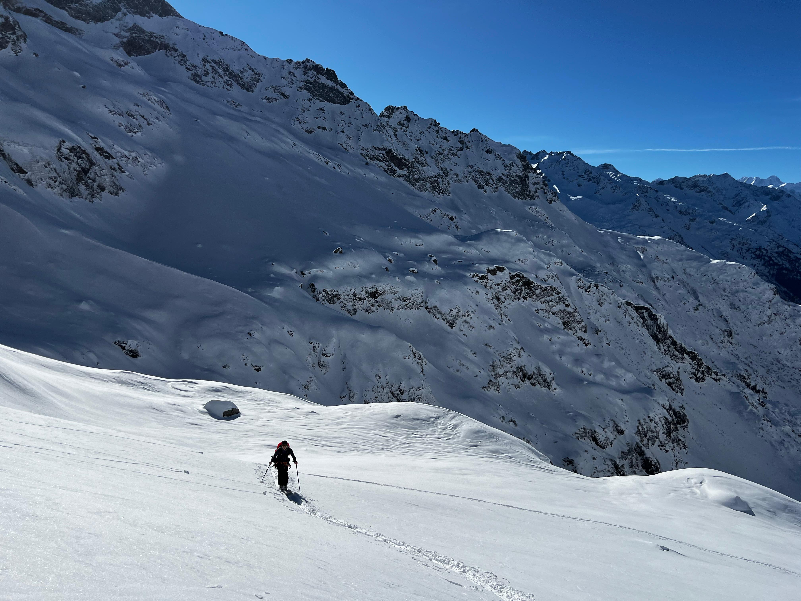
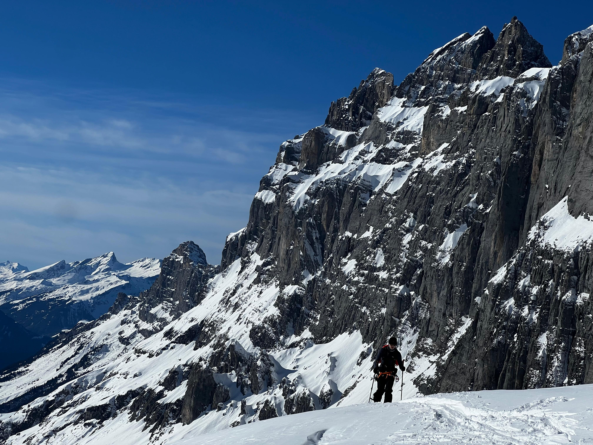

### Rocky Start

For this tour, we headed to Engelberg for a true Swiss classic: the Titlis Roundtour. Despite its proximity to us, it was our first time experiencing it. Engelberg is renowned for its many freeride lines and attracts a fair number of powder enthusiasts. This day was no exception. Before the first gondola opened, there was a huge queue. Luckily, we had arrived early and managed to secure a spot near the front.

However, our luck didn’t last long. After the first gondola ride, we discovered that the glacier and the cable car leading further up were closed due to strong winds.

And so, the wait began.

---

### Start of a Race

After an hour-long wait, they finally reopened the cable car. Everyone rushed towards it, and we weren’t about to be left behind. Thanks to some sweet-talking, Laurin managed to snag the very last spot on the first gondola.

But the real race was just beginning. Several groups were already heading towards the first rappel point.

---

### The Key Point

Still anxious that the winds might return, we couldn’t fully enjoy our first turns on the glacier. We carefully navigated around a crevasse and traversed toward "The Knife"—a narrow ridge dotted with boulders that required a short climb. After a quick switch to crampons and securing our skis to our packs, we crossed the ridge and reached the first rappel point.

We arrived as the second group. Quickly setting up our rappel, we descended 30 meters into a small couloir. From there, it was possible to walk down a bit and begin skiing from a slightly wider section. I decided to give it a go. A few jump turns later, the couloir opened up, revealing a wide slope with beautiful powder.

---

### The Second Rappel

The next rappel was trickier. With four anchor points, there was no obvious solution to navigate this section. We opted to bypass the first anchor and head directly to the second. From there, we debated whether it might be possible to descend without using the rope, scouting a potential line. Unfortunately, there wasn’t enough snow, and to avoid damaging our skis, we chose to rappel again.

After this, a few perfectly executed turns led us toward the next challenge: the ascent.

---

### The Ascent

The start of the ascent was tough. With a 35-degree slope and slippery snow, progress was slow. But eventually, we reached the ridge and, with it, the almost-flat glacier.

Relieved, we took a moment to enjoy the breathtaking scenery before skinning toward the Grassen bivouac. As we approached the summit, the wind began to pick up. Concerned it might worsen, we quickened our pace.

At the top, we sought refuge in the bivouac hut, where we warmed up, enjoyed lunch, and sipped hot tea.

---

### The Main Course

Re-energized and eager, we prepared for the descent. Skins: off. Boots: locked. Helmets: on. Stoke level: high. With 1,500 meters of untouched powder ahead of us, we dropped in.

Each turn felt like floating. The powder was smooth, though the terrain underneath wasn’t always as forgiving, with occasional bumps adding a touch of excitement. We cruised through creeks and finally reached the tree line.

From there, we carried our skis to spare them from damage. At last, we emerged into the basin, where we joined a cross-country ski trail. Channeling our finest skating technique, we glided to the bus station.

Another Varied Tour Successfully Completed

